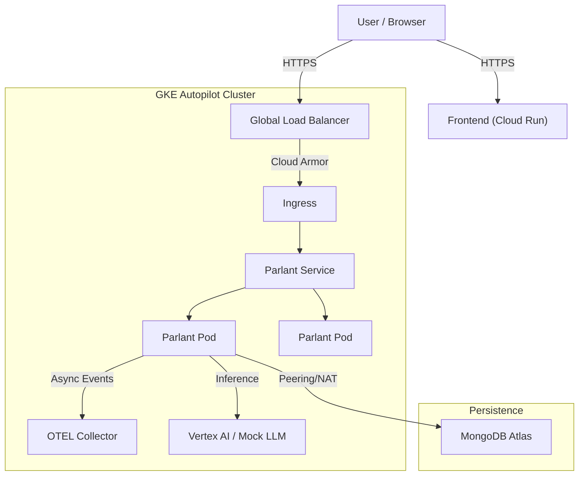

# **Healthcare Agent on GKE Autopilot 🏥 🤖**

A production-grade reference architecture for deploying a **Parlant-based AI Agent** on **Google Kubernetes Engine (GKE) Autopilot**.

This project demonstrates how to build, secure, observe, and scale a stateful AI agent that integrates with **Vertex AI (Gemini)** and **MongoDB Atlas**. It features a unique "Simulated Scale" testing framework to validate infrastructure limits (NAT ports, DB connections) deterministically without incurring LLM inference costs.

## **🌟 Key Features**

* **GKE Autopilot Architecture**: Optimized for cost and security with private nodes and tuned Cloud NAT.  
* **Parlant Framework**: Uses [Parlant](https://www.parlant.io/) for agentic workflow management, guideline enforcement, and session state.  
* **Simulated Scale Testing**: A specialized harness using a **Mock LLM Server** (FastAPI) and **Locust** to test concurrency limits.  
* **Production Security**:  
  * **Workload Identity Federation**: Zero-key authentication for GitHub Actions (Scripts included).  
  * **Cloud Armor**: WAF policies for rate limiting and XSS protection.  
  * **Least Privilege IAM**: Separate Service Accounts for Application (parlant-sa) and Observability (parlant-otel-sa).  
* **Full-Stack Observability**: OpenTelemetry (OTEL) Collector exporting traces to Google Cloud Trace and metrics to Managed Prometheus.  
* **Custom Frontend**: A Next.js 15 Enterprise-grade chat interface using Server-Sent Events (SSE) and React 19 primitives.

## **🏗 Architecture**



## **📂 Directory Structure**

```
healthcare-agent-gke-autopilot/  
├── backend/  
│   ├── auth.py                  # Custom Auth Policy  
│   ├── main.py                  # FastAPI Entrypoint  
│   ├── setup.sh                 # Infrastructure Provisioning (GKE, VPC, NAT)  
│   ├── load_testing/            # Simulated Scale Framework  
│   └── docs/                    # Architectural decisions & guides  
└── frontend/  
    ├── src/                     # Next.js App Router Source  
    └── Dockerfile               # Optimized Standalone Build
```

## **🚀 Quick Start (Local Development)**

You can run the stack locally. The **Backend** runs in Docker Compose, and the **Frontend** runs in Node.js.

### **1. Start Backend Services**

The run-scale-test.sh script includes a local mode that spins up the Agent, Mock LLM, MongoDB, and Locust.

```bash
cd backend  
./load_testing/run-scale-test.sh local
```

* **Parlant Agent**: http://localhost:8800  
* **Mock LLM**: http://localhost:8000

### **2. Start Frontend App**

Open a new terminal.

```bash
cd frontend  
cp .env.local.example .env.local  
# Ensure NEXT_PUBLIC_PARLANT_API_URL=http://localhost:8800 in .env.local  
npm install  
npm run dev
```

Open [**http://localhost:3000**](https://www.google.com/search?q=http://localhost:3000) to chat with the agent.

## **☁️ Production Deployment (GCP)**

### **Prerequisites**

1. **GCP Project**: Active project with billing enabled.  
2. **MongoDB Atlas**: Create a cluster. **Important:** Whitelist the Cloud NAT IP (retrieved in Step 3) or configure VPC Peering.

### **Step 1: Backend Configuration**

Create a .env file in backend/ based on the example. This will be converted into a Kubernetes Secret.

```bash
cd backend  
cp .env.example .env  
# Edit .env with your MongoDB URIs and JWT Secret

### **Step 2: Build & Push Backend Image**

The GKE setup script expects the image in the Artifact Registry.

# 1. Enable API & Configure Docker  
gcloud services enable artifactregistry.googleapis.com  
gcloud auth configure-docker us-central1-docker.pkg.dev

# 2. Create Repository  
gcloud artifacts repositories create parlant-repo --repository-format=docker --location=us-central1 --description="Parlant Docker Repo"

# 3. Build & Push  
export PROJECT_ID=$(gcloud config get-value project)  
docker build -t us-central1-docker.pkg.dev/$PROJECT_ID/parlant-repo/parlant-agent:latest -f Dockerfile-GKE-Autopilot .  
docker push us-central1-docker.pkg.dev/$PROJECT_ID/parlant-repo/parlant-agent:latest
```

### **Step 3: Infrastructure Setup**

Run the automated setup script. This provisions VPC, Cloud NAT, Router, GKE Cluster, IAM, and Ingress.

```bash
./setup.sh
```

*Note: This takes ~15-20 minutes. At the end, it will output the **Public IP Address**.*

### **Step 4: Verify & Get NAT IP**

Ensure resources are healthy and get the NAT IP to whitelist in MongoDB Atlas.

```bash
./verify.sh  
./show_nat_ip.sh  
# Add the output IP from show_nat_ip.sh to MongoDB Atlas Network Access
```

### **Step 5: Build & Deploy Frontend**

Now that we have the Backend IP, we can build the frontend. Next.js requires the API URL at **build time**.

# 1. Get the Ingress IP (if you missed it in Step 3)

```bash  
export API_IP=$(gcloud compute addresses describe parlant-global-ip --global --format='value(address)')  
echo "API Endpoint: http://$API_IP"
```

# 2. Create Production Env File  

```bash
cd ../frontend  
echo "NEXT_PUBLIC_PARLANT_API_URL=http://$API_IP" > .env
echo "NEXT_PUBLIC_AGENT_ID=healthcare-agent" >> .env
```

# 3. Build & Push Frontend Image

```bash
docker build -t us-central1-docker.pkg.dev/$PROJECT_ID/parlant-repo/healthcare-frontend:latest .  
docker push us-central1-docker.pkg.dev/$PROJECT_ID/parlant-repo/healthcare-frontend:latest
```

# 4. Deploy to Cloud Run (Serverless)  

```bash
gcloud run deploy healthcare-frontend   
  --image us-central1-docker.pkg.dev/$PROJECT_ID/parlant-repo/healthcare-frontend:latest   
  --platform managed   
  --region us-central1   
  --allow-unauthenticated
```

*Click the resulting Cloud Run URL to access your production agent.*

## **🔐 CI/CD: Workload Identity Federation**

To enable GitHub Actions to deploy to GKE without storing static JSON keys:

1. **Setup WIF**:

```bash
   cd backend  
   ./setup-github-wif.sh <GITHUB_ORG>/<REPO_NAME>
```   

2. **Configure GitHub Secrets**: The script will output the values (GCP_WORKLOAD_IDENTITY_PROVIDER, GCP_SERVICE_ACCOUNT) to add to your repository secrets.

## **🧪 Simulated Scale Testing**

Agentic workloads are **I/O bound**. We use a **Mock LLM** strategy to test infrastructure limits (NAT ports, DB connections) without LLM costs.

### **1. Redeploy in Test Mode**

Switches GKE deployment from Vertex AI to the internal Mock LLM service and deploys Locust.

```bash
cd backend  
./load_testing/redeploy-for-load-testing.sh
```

### **2. Execute Test Phases**

# Phase 1: Baseline (5 Users)  

```bash
./load_testing/run-scale-test.sh baseline
```

# Phase 2: Knee-Point Discovery (Ramp to 50+ users)  

```bash
./load_testing/run-scale-test.sh kneepoint
```

*View reports in backend/results/.*

### **3. Revert to Production**

```bash
./load_testing/redeploy-for-load-testing.sh --revert
```

## **📊 Observability**

* **Traces**: **Google Cloud Trace**. Visualize latency breakdown (Agent logic vs DB vs LLM).  
* **Metrics**: **Managed Prometheus**. Monitor parlant custom metrics.  
* **Logs**: **Cloud Logging**. Structured JSON logs.

**Dashboarding**: Use the MQL queries in [backend/load_testing/monitoring-queries.md](https://www.google.com/search?q=backend/load_testing/monitoring-queries.md) to monitor Cloud NAT Port Usage and Pod Memory.

## **🧹 Teardown & Cleanup**

To avoid incurring charges, **always** run the cleanup script when finished:

```bash
cd backend  
./clean-up.sh
```

This deletes the GKE Cluster, Load Balancers, NAT Gateways, and IAM bindings.