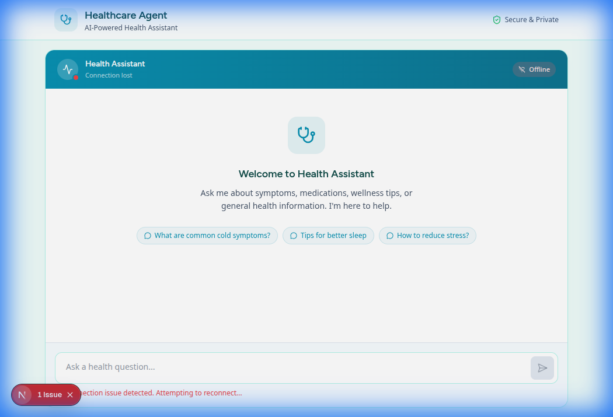
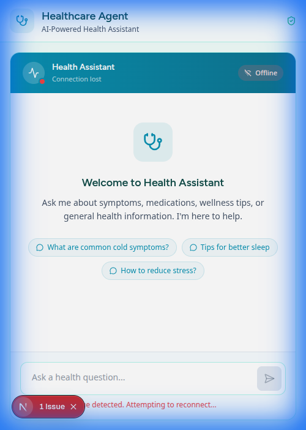

# Healthcare Agent Frontend — UI/UX Redesign Walkthrough

## Overview

Redesigned the healthcare-agent-gke-autopilot frontend from a bare-bones Tailwind default chat box to a premium, branded healthcare chat interface.

## Design System

| Token | Value | Purpose |
|-------|-------|---------|
| Primary | `#0891B2` | Medical teal — headers, avatars, buttons |
| Secondary | `#22D3EE` | Cyan accent — highlights |
| CTA | `#22C55E` | Health green — status, badges |
| Background | `#F0FDFA` | Mint tint page background |
| Text | `#134E4A` | Dark teal body text |
| Fonts | Figtree / Noto Sans | Medical, clean, accessible |

## Files Modified (8 total)

| File | Changes |
|------|---------|
| [tailwind.css](file:///../../styles/tailwind.css) | Design tokens, Google Fonts, chat animations, reduced-motion, markdown styles |
| [layout.tsx](file:///../../app/layout.tsx) | Page metadata, font preconnects, body classes |
| [page.tsx](file:///../../app/page.tsx) | Full-screen layout, branded header with stethoscope icon |
| [parlant-chat.tsx](file:///../../src/components/parlant-chat.tsx) | Gradient header, animated status dot, connection badges |
| [chat-bubble.tsx](file:///../../src/components/ui/chat/chat-bubble.tsx) | Rounded avatars, role labels, fade-in animation |
| [chat-input.tsx](file:///../../src/components/ui/chat/chat-input.tsx) | Auto-resize textarea, send button with Lucide icon, focus ring |
| [chat-list.tsx](file:///../../src/components/ui/chat/chat-list.tsx) | Welcome empty state with suggestions, 3-dot bouncing typing indicator |
| [error-boundary.tsx](file:///../../src/components/error-boundary.tsx) | Styled error card with warning icon and retry button |

> [!NOTE]
> Also fixed pre-existing issues: `any` → `unknown[]` and non-null assertions in [use-parlant.ts](file:///../../src/hooks/use-parlant.ts).

## Visual Verification

````carousel

<!-- slide -->

````

## Build Verification

```
✓ npm run build — Exit code: 0
✓ Route /  — 62.1 kB (163 kB first load)
✓ No lint errors, no type errors
```
